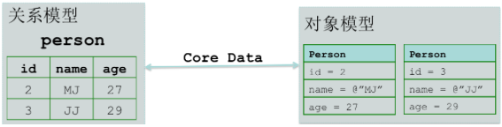
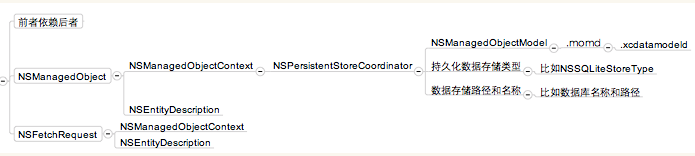

# iOS-CoreData
##1.CoreData的原理
        CoreData是iOS5之后才出现的框架，他提供了对象-关系映射（ORM）的功能，即能
    够将oc对象转换成数据，保存在SQLite数据库文件中，也能够将保存在数据库中的数据
    还原成oc对象。再次操作期间，我们不需要编写任何SQL语句。
        简单地用下图描述他的作用：

        左边是关系模型，即数据库，数据库里有张person表，person表中有id、name、age
    三个字段，而且有2条记录；
        右边是对象模型，即可以看到有2个oc对象；
        利用CoreData框架，我们可以轻松地将数据库里面的2条记录转换成2个oc对象，也可
    以轻松地将2个对象保存到数据库中，变成2条记录，而且不用写SQL语句。
##2.CoreData的构成
    ① NSManagedObjectContext：被管理的数据上下文
        用来实际操作数据，例如插入数据，查询数据，删除数据等；
    ② NSManagedObjectModel：被管理的数据模型
        他是数据库所有表格或数据结构，包含各实体的定义信息；
        可以用来添加实体的属性，建立属性之间的关系；
    ③ NSPersistentStoreCoordinator：持久化存储助理：
        相当于数据库的连接器；
        可以设置数据存储的名字，位置，存储方式，和存储时机；
    ④ NSManagedObject：被管理的数据记录
        相当于数据库中的表格记录；
    ⑤ NSFetchRequest：获取数据的请求
        相当于查询语句
    ⑥ NSEntityDescripition：实体结构
        相当于表格结构
    ⑦ 后缀为.xcdatamodeld的包
        里面是.xcdatamodel文件，用数据模型编辑器编辑
        编译后为.momd或.mom文件
    他们的依赖关系如下：

